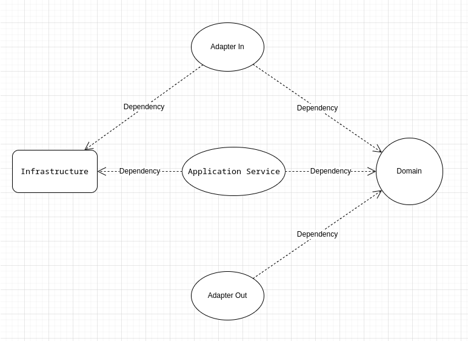

# Backend Challenge - Nisum

Este proyecto es una API RESTful desarrollada como parte del desafío técnico de Nisum Latam. Permite el registro de usuarios, autenticación con JWT, gestión del estado activo y consulta de usuarios. La solución está basada en arquitectura hexagonal y los principios SOLID, con un enfoque modular y testeable.

## Tabla de Contenido

- [Tecnologías Usadas](#tecnologías-usadas)
- [Arquitectura del Proyecto](#arquitectura-del-proyecto)
- [Funcionalidades Implementadas](#funcionalidades-implementadas)
- [Instalación y Ejecución](#instalación-y-ejecución)
- [Swagger](#swagger)
- [Cobertura de Tests](#cobertura-de-tests)
- [Tests Automatizados](#tests-automatizados)
- [Comandos CURL](#comandos-curl)
- [Notas Importantes](#notas-importantes)

## Tecnologías Usadas

- Java 21
- Spring Boot 3.x
- Maven Wrapper (`./mvnw`)
- JWT (JSON Web Tokens)
- Lombok
- JUnit 5
- Mockito
- Spring Validation
- MapStruct (generación automática de mappers)
- JaCoCo (para reporte de cobertura de tests)

## Arquitectura del Proyecto

Se utilizó **arquitectura hexagonal (puertos y adaptadores)** con separación clara entre controladores, lógica de dominio y persistencia.  
Se aplicaron los **principios SOLID**, priorizando mantenibilidad, testabilidad y bajo acoplamiento.



## Funcionalidades Implementadas

- Registro de usuarios con validaciones complejas y lista de teléfonos.
- Autenticación por email y contraseña, con emisión de token JWT.
- Validación de usuarios autenticados en endpoints protegidos.
- Cambiar estado activo/inactivo del usuario.
- Obtener un usuario por ID.
- Listar usuarios paginadamente.
- Manejo de errores centralizado con `@ControllerAdvice`.

## Instalación y Ejecución

```bash
# Clonar el repositorio
git clone https://github.com/rodrisepulveda/user-registration.git
cd user-registration

# Ejecutar el proyecto
./mvnw spring-boot:run
```

## Swagger

Una vez iniciado el proyecto, puedes acceder a la documentación en:

[http://localhost:8080/swagger-ui/index.html](http://localhost:8080/swagger-ui/index.html)

## Cobertura de Tests

Para generar el informe de cobertura con JaCoCo:

```bash
./mvnw clean verify
```

El reporte estará disponible en: `target/site/jacoco/index.html`

## Tests Automatizados

Los siguientes escenarios están cubiertos por tests unitarios y de integración:

- Registro de usuario (validez, campos faltantes, email duplicado, etc.)
- Autenticación (JWT válido e inválido)
- Manejo de errores y excepciones
- Listado paginado
- Validación de parámetros
- Obtener usuario por ID
- Cambio de estado activo
- Cobertura completa del `ControllerAdvice`

## Comandos CURL

### 1. Crear usuario

```bash
curl -X POST http://localhost:8080/api/users -H "Content-Type: application/json" -d '{
  "name": "Rodrigo",
  "email": "rodrigo@correo.com",
  "password": "Password123!",
  "phones": [
    { "number": "12345678", "cityCode": "9", "countryCode": "56" }
  ]
}'
```

### 2. Login

```bash
curl -X POST http://localhost:8080/api/users/login -H "Content-Type: application/json" -d '{
  "email": "rodrigo@correo.com",
  "password": "Password123!"
}'
```

> El token JWT retornado debe incluirse en los siguientes endpoints. Este token puede ser tanto el generado durante el login como el entregado por el endpoint de creación de usuario.

### 3. Obtener usuario por ID

```bash
curl -X GET http://localhost:8080/api/users/{id} -H "Authorization: Bearer <jwt>"
```

### 4. Cambiar estado activo

```bash
curl -X PATCH http://localhost:8080/api/users/{id}/active -H "Authorization: Bearer <jwt>" -H "Content-Type: application/json" -d '{ "active": true }'
```

### 5. Listar usuarios

```bash
curl -X GET "http://localhost:8080/api/users/list?page=0&size=10" -H "Authorization: Bearer <jwt>"
```

## 6. Acceder a la base de datos H2 y revisar las tablas

Durante la ejecución local, puedes acceder a la consola web de H2 para visualizar y consultar las tablas creadas por la aplicación:
	Asegúrate de tener la aplicación corriendo localmente (./mvnw spring-boot:run o ejecutando la clase NisumChallengeApplication).
	Abre tu navegador y accede a:
	
	http://localhost:8080/h2-console

	Ingresa las siguientes credenciales:

	JDBC URL: jdbc:h2:mem:testdb
	User Name: sa
	Password: (dejar vacío)

	Presiona "Connect".
	
Una vez dentro, puedes ejecutar SQL como:
	select * from USERS;
	select * from PHONE;
	
Las tablas estarán disponibles solo mientras la aplicación esté corriendo, ya que se trata de una base de datos en memoria.

## Notas Importantes

- Si el usuario está **inactivo**, aunque tenga un token válido **no podrá acceder a endpoints protegidos**.
- Se utilizó `@ControllerAdvice` para centralizar el manejo de errores, retornando mensajes claros para el cliente.
- MapStruct se utiliza para mapear DTOs a entidades de dominio automáticamente (ver interfaces `UserRequestMapper`, `UserResponseMapper`).

